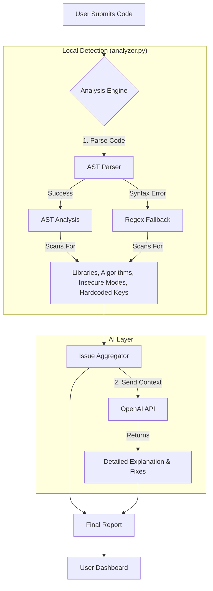

# CryptX Current Workflow

This document outlines the current data flow and architecture of the CryptX application.

## detailed Steps

1.  **Input Submission**: You submit Python code via the web interface (`app_enhanced.py` endpoint `/analyze`).
2.  **Detection Phase** (`detect_encryption`):
    *   **AST Method**: The system attempts to parse the code into an Abstract Syntax Tree. It looks for specific imports (`Crypto`, `cryptography`) and class usages (`AES`, `RSA`).
    *   **Fallback**: If the code snippet is incomplete or has syntax errors, it falls back to Regex matching to identify keywords.
3.  **Vulnerability Analysis** (`analyze_crypto_code`):
    *   **Static Analysis**: The system walks the AST to find known vulnerabilities:
        *   **ECB Mode**: Checks for `AES.MODE_ECB`.
        *   **Weak Keys**: Checks for keys shorter than 16 bytes.
        *   **Hardcoded Secrets**: Checks for key variables assigned to literal strings/bytes.
        *   **Weak Randomness**: Checks for `random` module usage instead of `secrets`.
4.  **AI Enrichment** (`suggest_with_openai`):
    *   The detected issues and the original code are sent to OpenAI (GPT-4o).
    *   The AI provides a human-readable explanation of *why* the vulnerability is dangerous and generates a secure, corrected code snippet.
5.  **Reporting**: A JSON response containing the detection tags, specific issues, and the AI's suggestions is returned and rendered on the frontend.
